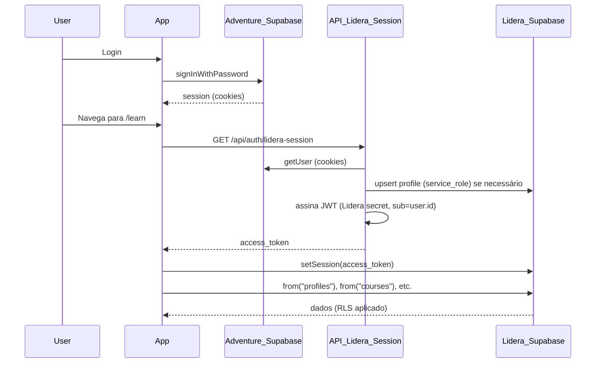

# Retomar Auth e Database para acessar o app

O código já está preparado para **Auth no Supabase Adventure** e **dados no Supabase Lidera**. Para conseguir acessar o app, siga este checklist de configuração.

---

## Fluxo atual (já implementado)



---

## 1. Supabase Adventure (Auth)

| Passo | Onde | Ação |
|-------|------|------|
| 1.1 | Dashboard do projeto **Adventure** (ftctmseyrqhckutpfdeq) | Authentication > URL Configuration: **Site URL** = URL do app (ex.: `https://seu-app.vercel.app` ou `http://localhost:3000`) |
| 1.2 | Mesma tela | **Redirect URLs**: adicionar a URL do app (ex.: `https://lidera.adventurelabs.com.br`, `https://lidera.adventurelabs.com.br/auth/callback`) e, para dev, `http://localhost:3000/**` |
| 1.3 | Authentication > Users | Criar pelo menos um usuário (Add user): email + senha. Esse usuário será usado para fazer login no app (no remoto o seed não popula `auth.users`). **Use login por email/senha** no Lidera (não use "Entrar com Google" se o redirect ainda mandar para o site da Adventure). |

Não é necessário rodar migrations no Adventure se ele for usado só para Auth.

### Usuários de teste (senha no código)

No repositório há usuários de demonstração com **senha inicial: `adv123`** (ver `supabase/migrations/20260213000002_reset_users_adv123.sql`). No **setup dual**, esses usuários não são criados por migration; é preciso criá-los no **Supabase Adventure** (Authentication > Users > Add user) com o mesmo email e senha. Exemplos:

| Email | Senha | Uso |
|-------|--------|-----|
| `admin@adventurelabs.com.br` | `adv123` | Admin (acesso total) |
| `lidera@adventurelabs.com.br` | `adv123` | Tenant (gestor Lidera) |
| `aluno@adventurelabs.com.br` | `adv123` | Aluno |

Depois do primeiro login, no **Lidera** (SQL Editor) ajuste o perfil se precisar: `UPDATE profiles SET role = 'admin', org_id = '...' WHERE email = 'admin@adventurelabs.com.br';` (ver comentários no `seed.sql`).

---

## 2. Supabase Lidera (Database)

| Passo | Onde | Ação |
|-------|------|------|
| 2.1 | Dashboard do projeto **Lidera** (wswtafmzzrfzamcpqvxf) | SQL Editor: executar as migrations **nessa ordem**: `20260211000001_initial_schema.sql`, `20260211000002_rls_policies.sql`, `20260212000001_pending_invites.sql`, `20260212000002_storage_thumbnails.sql`, `20260227000001_lidera_dual_allow_external_profiles.sql`, `20260227100001_admin_view_lesson_progress.sql` |
| 2.2 | SQL Editor | Executar o conteúdo de `supabase/seed.sql` (organizações, cursos, módulos, aulas, tarefas, recursos). O seed não insere usuários nem matrículas; usuários vêm da Adventure e o app sincroniza o perfil no Lidera no primeiro login. Para matricular, use o painel do tenant após o usuário entrar no app. |
| 2.3 | Settings > API (Lidera) | Anotar: **Project URL**, **anon** (public), **JWT Secret**, **service_role**. Usar nas variáveis de ambiente abaixo. |

---

## 3. Variáveis de ambiente

### Local (`.env.local`)

Copiar do `.env.example` e preencher:

- `NEXT_PUBLIC_SUPABASE_URL` e `NEXT_PUBLIC_SUPABASE_ANON_KEY` = Adventure (Settings > API).
- `NEXT_PUBLIC_LIDERA_SUPABASE_URL` e `NEXT_PUBLIC_LIDERA_SUPABASE_ANON_KEY` = Lidera (Settings > API).
- `LIDERA_SUPABASE_JWT_SECRET` = Lidera > Settings > API > JWT Secret.
- `LIDERA_SUPABASE_SERVICE_ROLE_KEY` = Lidera > Settings > API > service_role key.
- **`NEXT_PUBLIC_APP_URL`** = URL base do app (ex.: `https://lidera.adventurelabs.com.br`). Usado no OAuth para o Supabase redirecionar de volta para o Lidera após o login com Google; se não definir, o redirect pode cair no Site URL do projeto Adventure (ex.: www) e o usuário ver a tela errada.

### Vercel

Settings > Environment Variables. Criar as mesmas variáveis (incluindo **NEXT_PUBLIC_APP_URL** = `https://lidera.adventurelabs.com.br` em Production). Depois fazer **Redeploy** para aplicar.

---

## 4. Testar

| Ambiente | Passo |
|----------|--------|
| Local | `npm run dev` → abrir `http://localhost:3000` → Login com o usuário criado no **Adventure** (passo 1.3). Após login, o app chama `/api/auth/lidera-session`, sincroniza perfil no Lidera e exibe dados. |
| Vercel | Deploy feito; Site URL e Redirect URLs no **Adventure** apontando para a URL do deploy. Entrar com o mesmo usuário da Adventure. |

Se o perfil no Lidera não tiver `role`/`org_id` desejados, no SQL Editor do **Lidera** atualizar `profiles` (usar o mesmo `id` do usuário da Adventure): por exemplo `role = 'tenant'`, `org_id = '00000000-0000-0000-0000-000000000002'` (Lidera).

---

## Resumo rápido

1. **Adventure:** configurar Site URL e Redirect URLs; criar 1 usuário em Authentication > Users.
2. **Lidera:** rodar as 5 migrations + seed; anotar URL, anon, JWT Secret e service_role.
3. **App:** preencher as 6 variáveis em `.env.local` (local) e na Vercel (produção); na Vercel, redeploy.
4. **Acessar:** login com o usuário da Adventure; dados vêm do Lidera.

Nenhuma alteração de código é necessária; apenas configuração nos dashboards e env vars.

---

## 5. Vinculação das CLIs (opcional)

Com os projetos vinculados via CLI, você pode rodar comandos que afetam o Lidera (Supabase) e o deploy (Vercel) com segurança.

### Supabase CLI (projeto Lidera)

A CLI do Supabase permite vincular **um** projeto por pasta. Vincule ao **Lidera** (banco de dados do app):

```bash
supabase login
supabase link --project-ref wswtafmzzrfzamcpqvxf
```

Quando pedir, use a **database password** do projeto **Lidera** (Settings > Database no dashboard do Lidera). Depois:

| Comando | Uso |
|--------|-----|
| `supabase db push` | Envia as migrations locais para o banco Lidera remoto. |
| `supabase db pull` | Gera migration a partir do schema atual do Lidera. |
| `npm run db:types` | Gera tipos TypeScript em `src/types/database.ts` a partir do schema do Lidera. |

### Vercel CLI

```bash
vercel login
vercel link
```

Escolha a scope e o projeto correspondente ao deploy (ex.: `lidera.adventurelabs.com.br`). Depois:

| Comando | Uso |
|--------|-----|
| `vercel` | Deploy de preview. |
| `vercel --prod` | Deploy em produção. |
| `vercel env pull .env.local` | Baixa as variáveis de ambiente do Vercel para `.env.local`. |
| `vercel env ls` | Lista variáveis do projeto. |

### GitHub

O repositório já está associado ao Git. Para conferir o remote:

```bash
git remote -v
```

Se usar o [GitHub CLI](https://cli.github.com/) (`gh`): `gh auth status` ou `gh auth login`; depois `gh pr list`, `gh pr create`, etc.
